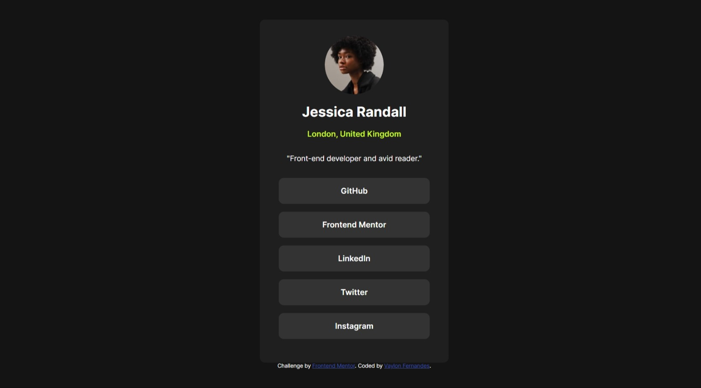

# Frontend Mentor - Social links profile solution

This is a solution to the [Social links profile challenge on Frontend Mentor](https://www.frontendmentor.io/challenges/social-links-profile-UG32l9m6dQ). 

## Table of contents

- [Overview](#overview)
  - [The challenge](#the-challenge)
  - [Screenshot](#screenshot)
  - [Links](#links)
- [My process](#my-process)
  - [Built with](#built-with)
  - [What I learned](#what-i-learned)
- [Author](#author)

## Overview

### The challenge

Users should be able to:

- See hover and focus states for all interactive elements on the page

### Screenshot



### Links

- Solution URL: [Add solution URL here](https://your-solution-url.com)
- Live Site URL: [Add live site URL here](https://your-live-site-url.com)

## My process

### Built with

- Semantic HTML5 markup
- CSS custom properties
- Flexbox


### What I learned

Using CSS custom properties:


```css
:root{ 
    --primary-green:  hsl(75, 94%, 57%);
    --off-black:  hsl(0, 0%, 8%);
    --dark-gray:  hsl(0, 0%, 12%);
    --gray:hsl(0, 0%, 20%);
    --white: hsl(0, 0%, 100%)
}

body{ 
    background-color: var(--off-black);
    padding: 2em;
}
```


## Author

- Website - [My Portfolio](https://vaylon-fernandes.netlify.app/)
- Frontend Mentor - [@vaylon-fernandes](https://www.frontendmentor.io/profile/vaylon-fernandes)
- GitHub - [@vaylon-fernandes](https://github.com/vaylon-fernandes)
- LinkedIn - [Vaylon Fernandes](https://www.linkedin.com/in/vaylon-fernandes/)
- HackerRank - [@vaylonfernandes](https://www.hackerrank.com/profile/vaylonfernandes)
- LeetCode - [Vaylon](https://leetcode.com/Vaylon/)

